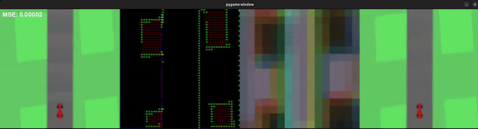
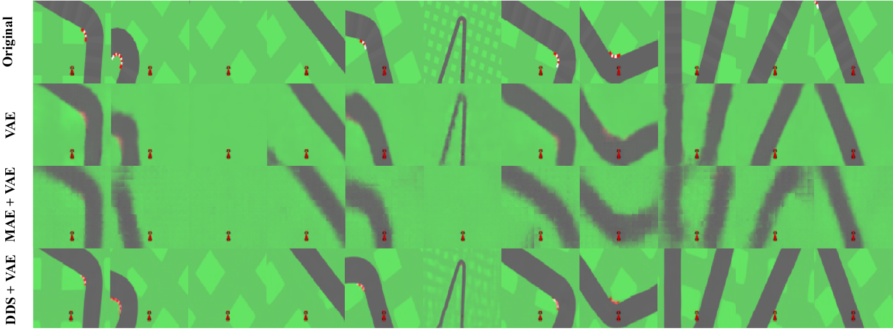
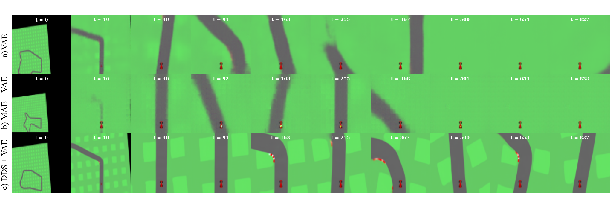

# **Perceptual Latent Representations: Improving Visual Fidelity and Autonomous Control in World Models**

[](https://www.python.org/downloads/)
[](https://pytorch.org/)
[](LICENSE)
[](memory.pdf)

> **Improving Visual Fidelity and Autonomous Control in World Models through Perceptual Latent Representations**

This repository contains the complete implementation of my Final Degree Work research on enhancing World Models through Dynamic Data Selection (DDS) and hierarchical autoencoder architectures with internal perceptual loss. The work addresses critical limitations in current World Models, particularly the visual quality of generated images and their impact on reinforcement learning agent performance.

<div align="center">

</div>

## Key Achievements

<div align="center">

| Metric | Improvement |
|--------|-------------|
| **FID (Fréchet Inception Distance)** | **53% reduction** |
| **FVD (Fréchet Video Distance)** | **26% reduction** |
| **Agent Performance** | **12% increase** |
| **Model Parameters** | **Maintained VAE baseline size** |

</div>

## Architecture Overview

Our proposed architecture introduces a novel hierarchical approach combining:

- **Dynamic Data Selection (DDS)**: Unsupervised instance-wise feature selection
- **U-Net Integration**: Structured spatial processing
- **Hierarchical Compression**: Multi-stage representation learning  
- **Mini-VAE**: Efficient latent space encoding with perceptual loss

<div align="center">

</div>

## Quick Start

### Prerequisites

An `environment.yml` file is provided for easy environment setup with conda.

### Model Training

Train the World Model components in sequence:

```bash
# 1. Generate training dataset
python src/rollouts.py

# 2. Train the vision model (DDS+VAE) - Phase 1
python src/train_dds_vae_stage1.py

# 3. Train the vision model (DDS+VAE) - Phase 2  
python src/train_dds_vae_stage2.py

# 4. Train memory model (MDN-RNN)
python src/train_memory.py

# 5. Train controller with CMA-ES
python src/train_controller.py
```

### Jupyter Notebooks

Launch the interactive analysis:


**Available Notebooks:**
- `1-Rollouts.ipynb` - Data generation and environment interaction
- `2-DDS+VAE.ipynb` - Vision model architecture and training
- `3-Memory.ipynb` - Temporal dynamics modeling
- `4-Controller.ipynb` - Agent training and evaluation

## Repository Structure

```
World Model DDS/
├── memory.pdf                       # Complete final degree work document (Spanish)
├── src/                             # Core implementation
│   ├── rollouts.py                  # Environment data collection
│   ├── train_dds_vae_stage1.py      # Vision model training (Phase 1)
│   ├── train_dds_vae_stage2.py      # Vision model training (Phase 2)
│   ├── train_memory.py              # Memory model (MDN-RNN) training
│   ├── train_controller.py          # Controller optimization (CMA-ES)
│   ├── models/                      # Neural network architectures
│   │   ├── dds_vae.py              # Dynamic Data Selection + VAE
│   │   ├── mdn_rnn.py              # Mixture Density Network RNN
│   │   ├── controller.py           # Linear controller
│   │   ├── dds/                    # DDS implementation
│   │   ├── minivae/                # Mini-VAE architecture
│   │   ├── unet/                   # U-Net implementation
│   │   └── UpscaleDownscale/       # Scaling modules
│   ├── utils/                       # Utilities and helpers
│   │   ├── dataset.py              # Data loading utilities
│   │   ├── plots.py                # Visualization functions
│   │   ├── utils.py                # General utilities
│   │   └── weights.py              # Model weight utilities
│   └── trained_models/              # Pre-trained model checkpoints
├── notebooks (self-explanatory)/    # Interactive Jupyter notebooks
│   ├── 1-Rollouts.ipynb
│   ├── 2-DDS+VAE.ipynb
│   ├── 3-Memory.ipynb
│   ├── 4-Controller.ipynb
│   └── imgs/                        # Visualization assets
└── README.md                        # This file
```

## Technical Innovation

### Dynamic Data Selection (DDS)

Our key contribution is a novel unsupervised feature selection mechanism:

<div align="center">

</div>


```python
# Conceptual overview
X_filtered = DDS(X) ⊙ X  # Element-wise masking
z = Encoder(X_filtered)   # Compressed representation
X_reconstructed = Decoder(z)  # High-fidelity reconstruction
```

**Benefits:**
- **Selective Attention**: Focus on relevant pixels (2-8% selection)
- **Noise Reduction**: Filter out irrelevant background information
- **Spatial Preservation**: Maintain image structure for CNNs
- **End-to-End Training**: Fully differentiable architecture

### Two-Phase Training Strategy


**Phase 1: Sparse Representation Learning**
- Train DDS + U-Nets for optimal sparse masks
- Learn to reconstruct from extremely sparse inputs (2-8% pixels)

**Phase 2: Latent Space Compression** 
- Train Mini-VAE with perceptual loss
- Compress sparse representations to normalized latent space

## Experimental Results

### Visual Quality Comparison

<div align="center">

</div>

### Performance Metrics

| Environment | Model | MSE ↓ | FID ↓ | FVD ↓ | Agent Reward ↑ |
|-------------|-------|-------|-------|-------|----------------|
| CarRacing-v3 | VAE Baseline | 0.00165 | 59.46 | 239 | 734.96 ± 162.75 |
| CarRacing-v3 | **DDS+VAE** | **0.00039** | **25.35** | **176** | **818.58 ± 147.05** |

### Dream Sequences

Our model generates more coherent and detailed "dream" sequences:

<div align="center">


</div>

## Technical Details

### Environment Support
- **CarRacing-v3**: Primary evaluation environment with procedural track generation
- **SuperMarioBros-v0**: Additional validation environment

### Model Components

#### Vision Model (V)
- **Input**: 96×96×3 RGB images
- **Output**: 32-dimensional latent vector z ∼ N(0,1)
- **Architecture**: DDS + U-Nets + Mini-VAE
- **Training**: Two-phase strategy with perceptual loss

#### Memory Model (M)  
- **Architecture**: LSTM + Mixture Density Network (MDN)
- **Function**: Predict $p(z_{t+1} | z_t, a_t, h_t)$
- **Features**: Stochastic predictions, temperature control

#### Controller (C)
- **Architecture**: Single linear layer
- **Optimization**: CMA-ES evolutionary strategy
- **Input**: [z_t, h_t] concatenation
- **Output**: Action vector for environment

### Key Hyperparameters

```python
# DDS Configuration
M_percentage = 0.03  # Select 3% of pixels
temperature = 0.1    # Hard concrete gate temperature

# VAE Configuration  
latent_dim = 32      # Latent space dimensions
beta = 1.0           # KL divergence weight
free_bits = 0.02     # Prevent posterior collapse

# MDN-RNN Configuration
hidden_size = 256    # LSTM hidden state
num_mixtures = 5     # Gaussian mixture components

# Training
batch_size = 32
learning_rate = 1e-4
epochs_phase1 = 1
epochs_phase2 = 2
```

## Evaluation Metrics

### Reconstruction Quality
- **MSE (Mean Squared Error)**: Pixel-level reconstruction accuracy

### Generation Quality  
- **FID (Fréchet Inception Distance)**: Distribution similarity of generated images
- **FVD (Fréchet Video Distance)**: Temporal coherence of generated sequences

### Agent Performance
- **Cumulative Reward**: Task performance in CarRacing environment over 100 tracks


## License

This project is licensed under the MIT License - see the [LICENSE](LICENSE) file for details.

## Acknowledgments

- **Advisors**: Brais Cancela Barizo and Carlos Eiras Franco
- **Institution**: Universidade da Coruña, Facultade de Informática
- **Inspiration**: David Ha and Jürgen Schmidhuber's seminal World Models work


---

<div align="center">


[Contact](mailto:brunocorcuerasanchez@gmail.com) • [University](https://www.udc.es/en/) • [Full Work](memoria.pdf)

</div>
